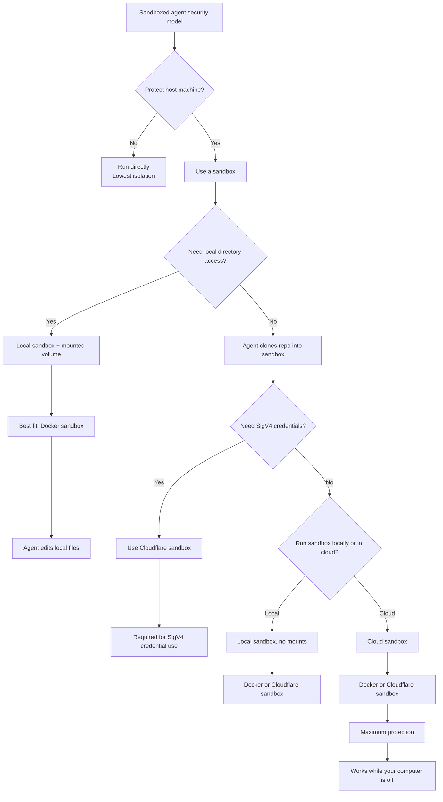

# Job Title Inferrer

A minimal [FastAPI](https://fastapi.tiangolo.com/) service with a single endpoint
that infers a job title from a job description using the
[OpenAI API](https://platform.openai.com/). Every successful inference is persisted
to a [Cloudflare R2](https://developers.cloudflare.com/r2/) bucket via the S3-compatible
API. Managed with [uv](https://docs.astral.sh/uv/).

## Setup

```bash
# Install dependencies (creates .venv automatically)
uv sync

# Configure secrets
cp .env.example .env
# then edit .env and set OPENAI_API_KEY and the R2_* variables
```

## Run

```bash
uv run uvicorn app.main:app --reload
```

Interactive docs are then available at http://127.0.0.1:8000/docs.

## API

### `POST /infer-title`

**Request body**

```json
{ "job_description": "Design and maintain scalable data pipelines and our warehouse." }
```

**Response**

```json
{ "job_title": "Data Engineer" }
```

Example:

```bash
curl -X POST http://127.0.0.1:8000/infer-title \
  -H "Content-Type: application/json" \
  -d '{"job_description": "Design and maintain scalable data pipelines."}'
```

| Status | Meaning                                                                |
| ------ | ----------------------------------------------------------------------- |
| 200    | Title inferred and stored successfully                                |
| 422    | Invalid request body (e.g. empty `job_description`)                   |
| 500    | `OPENAI_API_KEY` or R2 storage (`R2_*`) not configured                 |
| 502    | OpenAI request failed, returned an empty title, or the R2 write failed |

On success, the `job_description` and inferred `job_title` are written as a JSON
object to the configured R2 bucket under `inferences/<uuid>.json`. The write happens
before the response is returned, so a `200` always implies the record was stored.

## Configuration

All settings are read from environment variables / `.env` (see `.env.example`):

| Variable                  | Default       | Description                                      |
| ------------------------- | ------------- | ------------------------------------------------- |
| `OPENAI_API_KEY`          | _(required)_  | OpenAI API key                                   |
| `OPENAI_MODEL`            | `gpt-4o-mini` | Model used for inference                         |
| `REQUEST_TIMEOUT_SECONDS` | `30`          | OpenAI client request timeout                    |
| `R2_ACCOUNT_ID`           | _(required)_  | Cloudflare account ID (used to build the R2 endpoint) |
| `R2_ACCESS_KEY_ID`        | _(required)_  | R2 API token access key ID                       |
| `R2_SECRET_ACCESS_KEY`    | _(required)_  | R2 API token secret access key                   |
| `R2_BUCKET_NAME`          | _(required)_  | R2 bucket that inference records are written to  |

## Tests

```bash
uv run pytest
```

Tests are fully offline — the OpenAI client and the R2 client are both faked via
FastAPI dependency overrides, so no API key, R2 credentials, or network access is
required.

## Docker Sandbox Setup CLI

This repository also contains a standalone generic CLI package at
`tools/setup-docker-sandbox`. It can be installed as a machine-wide tool:

```bash
uv tool install ./tools/setup-docker-sandbox
```

Run it from any project directory to classify every variable in that project's
`.env` file, write repeatable `proxy-secrets.env` / `runtime.env` files, record non-secret
decisions in `sandbox-secrets.toml`, and apply supported Docker Sandbox secret
commands.

```bash
setup-docker-sandbox --dry-run
setup-docker-sandbox --env-file .env.local
start-docker-sandbox
```

Use `start-docker-sandbox` to refresh `runtime.env` into the selected workspace
sandbox's `/etc/sandbox-persistent.sh` before attaching. `proxy-secrets.env`
contains real proxy/registry secret values for repeatability and must be treated
like `.env`; do not pass it into sandbox processes.


## Sandbox Decision Tree

