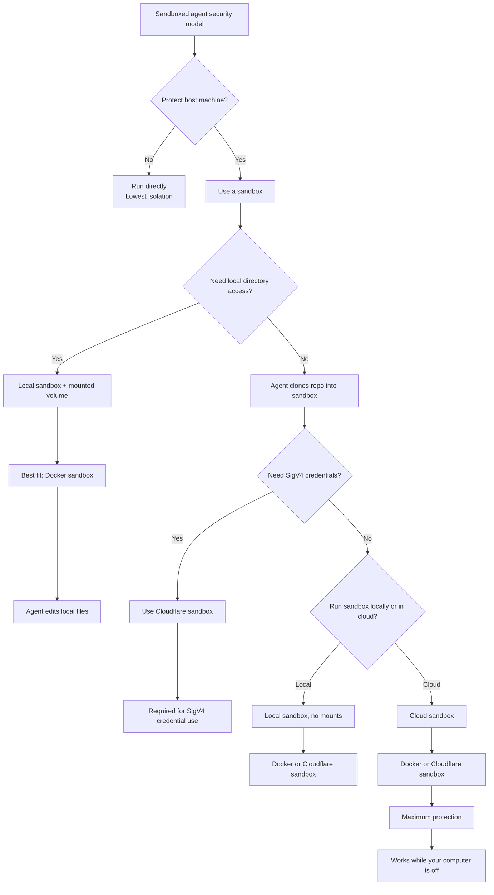

# Sandbox Experiments

This repository is a workspace for evaluating how agent sandboxes should be
created, configured, and operated around real application code.

The top level is intentionally about sandbox organization and workflow. The
sample application is self-contained under `app/`, and reusable host-side tools
live under `tools/`.

## Repository Layout

| Path | Purpose |
| --- | --- |
| `app/` | Sample FastAPI application, app-specific configuration, tests, and app README |
| `app/src/app/` | Sample app source code |
| `tools/setup-docker-sandbox/` | Reusable Docker Sandbox setup/start CLI package |
| `tools/` | Home for additional sandbox tools as they are added |

## Current Sandbox Model

The Docker Sandbox workflow separates host-side setup from runtime-visible app
configuration:

- Run app-specific setup from the app directory that owns `.env`.
- Keep proxy-managed or registry secret material host-side in `proxy-secrets.env`.
- Write only intentionally runtime-visible values into the sandbox from
  `runtime.env`.
- Store repeatable, non-secret setup decisions in `sandbox-secrets.toml`.
- Prefer clone-mode sandboxes for agent work when the sandbox should operate on
  an isolated Git clone instead of the host working tree.

For this repository's sample app, run the Docker Sandbox setup tools from
`app/`:

```bash
cd app
setup-docker-sandbox
start-docker-sandbox
```

## Sandbox Decision Tree



## Sample App

The sample app is documented in [app/README.md](app/README.md). Its local
configuration, tests, lockfile, and generated sandbox env files live there.

Common commands:

```bash
cd app
uv sync
PYTHONPATH=src uv run uvicorn app.main:app --reload
uv run pytest
```

## Tools

The Docker Sandbox setup tool is documented in
[tools/setup-docker-sandbox/README.md](tools/setup-docker-sandbox/README.md).

Install it as a local CLI tool:

```bash
uv tool install ./tools/setup-docker-sandbox
```

Reinstall after tool source changes:

```bash
uv tool install --reinstall ./tools/setup-docker-sandbox
```

Future sandbox tools, including possible Cloudflare Sandbox helpers, should be
added under `tools/` and documented independently.
